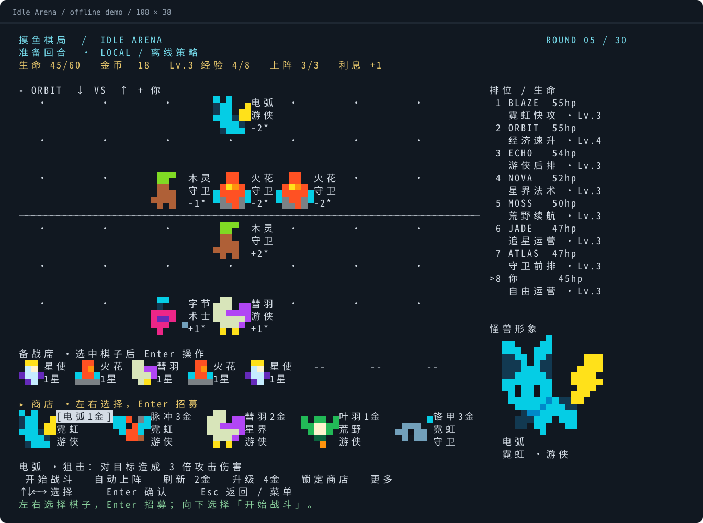

# 摸鱼棋局 · Idle Arena

**在终端里，和 7 位 Codex 对手下一局自走棋。**

招募像素怪兽、合成升星、凑羁绊、排阵容，然后看双方自动开打。准备回合没有倒计时；忙起来保存退出，下次接着玩。

[开始试玩](#play) · [操作与规则](docs/GUIDE.md) · [怪兽图集](assets/README.md) · [验证记录](validation/README.md)



*108×38 界面的离线样例，由游戏实际渲染函数导出。终端字体和颜色会略有差异。*

这是一个可玩的实验版：**18 枚原创棋子、6 类羁绊、8 人淘汰赛**。当前版本先保留在这里，后续方向和更新时间未定。

<a id="play"></a>
## 开始试玩

需要 **Python 3.11+**。macOS / Linux 支持全屏界面，游戏不依赖第三方 Python 包。终端建议 **108 列 × 38 行**，最低 **80×24**。

```bash
git clone https://github.com/rzr002/terminal-autochess.git
cd terminal-autochess
python3 play.py
```

默认另外 7 位玩家由本机 **Codex CLI** 决策，需要先安装 CLI 并完成 `codex login`。模型默认读取本机配置，也可通过 `--model 你的模型ID` 指定。每位存活对手每回合发起 **1–2 次模型请求**，会使用你的 Codex 账户额度，并需要等待模型返回。

**想先看看好不好玩？** 在项目目录用离线策略试玩，不需要 Codex 或网络：

```bash
python3 play.py --agent local --save .saves/local.json
```

界面会标明 `LOCAL / 离线策略`。Codex 模式连接失败时会提示重试，不会悄悄换成离线对手。

### 配一个短命令

安装一次：

```bash
python3 install.py
```

之后在任意目录运行：

```bash
autochess          # 启动，自动继续上次存档
autochess --new    # 新开一局，旧存档自动备份
```

安装器将入口写入 `~/.local/bin`，必要时显示 PATH 配置方法。移动项目或更换 Python 后重新安装即可。macOS 也可以在 Finder 中双击 [`play.command`](play.command)。

## 第一回合，三个动作

1. **左右选棋，Enter 招募。** 商店里直接显示价格、阵营和职业。
2. **向下选「上阵并开战」，Enter 确认。** 已买棋但还没布阵时，游戏会自动安排上阵位置。
3. **看战斗，Enter 进入下一回合。** 继续买棋、升人口、调整阵容。

| 操作 | 用法 |
| --- | --- |
| 方向键 | 上下切换区域，左右选择棋子或按钮 |
| Enter | 招募、打开棋子菜单、确认操作 |
| Esc | 返回；主界面打开「更多」 |

选中棋子按 Enter，可以上阵、移动、放回备战席或出售；移动时用方向键选择落点，再按 Enter。刷新、升级、锁店都是可选按钮。「更多」里可以侦察、查看帮助、隐藏棋局和保存退出。

## 棋局里有什么

| 玩法 | 你可以做什么 |
| --- | --- |
| 三合一升星 | 收集三枚同名同星棋子，自动合成为更高星，最高三星 |
| 经济运营 | 存钱吃利息、刷新追牌，或买经验提升上阵人数 |
| 阵容与羁绊 | 用霓虹、荒野、星界与守卫、游侠、术士搭配出阵容 |
| 自动战斗 | 站位、射程、护甲和技能参与演算，包含治疗与范围伤害 |
| 随时续玩 | 操作自动保存在本地，退出后可以接着玩 |

像素角色直接用终端色块绘制，不需要图片协议插件。商店显示小头像，大窗口的棋盘、备战席和右侧详情也显示形象。完整的 [18 角色图集与生成提示词](assets/README.md) 随仓库提供。

## Codex 对手会做什么

七个座位分别偏向法术、续航、快攻、后排、前排、追星和经济运营。每位对手看到自己的棋子与商店、公开棋盘和规则，然后给出买卖、升级与布阵计划。游戏校验行动，再在本地模拟战斗。

2026-09-09 的联调中，七个 Codex 对手完成了一轮准备和战斗结算，共 **7 次模型决策、49.08 秒**。这是一次运行记录，玩家位在该次验证中由离线策略代打；实际耗时随模型和网络变化。见 [完整记录](validation/codex-seven-opponents.json)。

## 当前边界

- 已有核心运营与战斗循环；暂不包含装备、选秀、野怪、强化符文或真人联机。
- 使用方格棋盘和独立商店，没有共享卡池。不是任何现有游戏的官方版本。
- 终端仍有信息密度与操作舒适度的限制。当前发布用于试玩和实验，没有成熟游戏体验或竞技平衡承诺。
- 64 项自动测试通过，另有 40 局完整离线模拟记录。真实模型已验证单轮联调，尚未验证连续整局的稳定表现。

[完整玩法、存档、模型配置与开发说明 →](docs/GUIDE.md)

## For English readers

Idle Arena is an experimental terminal auto-battler: recruit pixel monsters, combine units, build synergies, and face seven opponents powered by your local Codex CLI. The game UI is currently in Chinese. Use arrow keys, Enter, and Esc; preparation has no countdown and progress saves locally.

Requires Python 3.11+. Run `python3 play.py` for Codex opponents, or `python3 play.py --agent local --save .saves/local.json` to try offline. Codex mode uses your account quota and waits for model decisions. macOS and Linux support the full-screen UI; this is a playable prototype with no announced development schedule.
