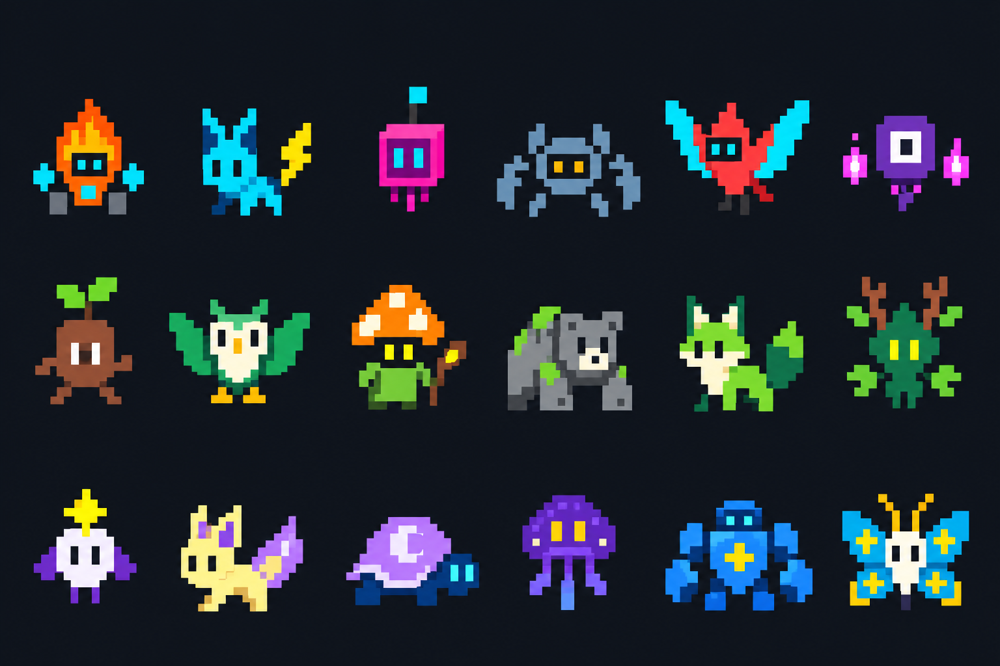

# 极简像素怪兽

`monsters.png` 是用内置 **imagegen** 生成、再简化的 18 角色 PNG 图集。图片在生成后原样复制到项目，没有用程序重绘或修改 PNG。完整提示词保存在 [prompts.md](prompts.md)。



图集从左到右，每行 6 个，按游戏中的棋子 ID 对应：

| 阵营 | 1 | 2 | 3 | 4 | 5 | 6 |
| --- | --- | --- | --- | --- | --- | --- |
| 霓虹 | 火花 spark | 电弧 volt | 字节 byte | 铬甲 chrome | 脉冲 pulse | 零号 zero |
| 荒野 | 木灵 bark | 叶羽 fern | 苔语 sage | 岩熊 bear | 风牙 fang | 森罗 grove |
| 星界 | 星使 oracle | 彗羽 comet | 月盾 moon | 星云 nebula | 天枢 titan | 极光 nova |

## 游戏显示

- `sprites.json` 保存从这张图集提取的 18 个独立 16×16 像素形象和共用色板，同时记录源 PNG 的 SHA-256。
- 终端使用 `▀`、`▄`、`█` 绘制彩色像素，每个终端字符容纳上下两个像素，不需要 Kitty / Sixel 等专用图像协议。
- 商店显示 6×6 缩略图；108×38 及更大的窗口中，棋盘也显示 6×6 缩略图，备战席显示 4×4 缩略图。
- 大窗口右侧和棋子操作菜单显示完整 16×16 头像。80×24 窗口仍可查看商店缩略图与棋子菜单头像。
- 256 色终端显示较完整的颜色；颜色较少的终端使用近似色，单色终端显示像素轮廓。
- 名字、星级、生命状态与选中标记继续保留。操作仍为方向键、Enter 和 Esc。

## 重新提取像素数据

只有更新图集后才需要运行。开发脚本依赖 Pillow，游戏本身不需要：

```bash
python3 scripts/build_sprites.py
```

脚本只读取原图并更新 JSON；不会改写原 PNG。转换时从各格边缘识别底色，保留封闭区域内的深色眼睛，再将像素映射到统一色板。

## README 界面预览

`terminal-preview.svg` 由实际游戏渲染函数导出，展示种子 6 的离线比赛第五回合准备界面。字体与配色以静态 SVG 表达，布局和角色数据来自游戏；不是实时 Codex 对局截图。

在项目根目录运行 `python3 scripts/render_preview.py` 可重新生成。脚本只使用标准库及项目代码，使用临时存档，不读取玩家存档或请求模型。
